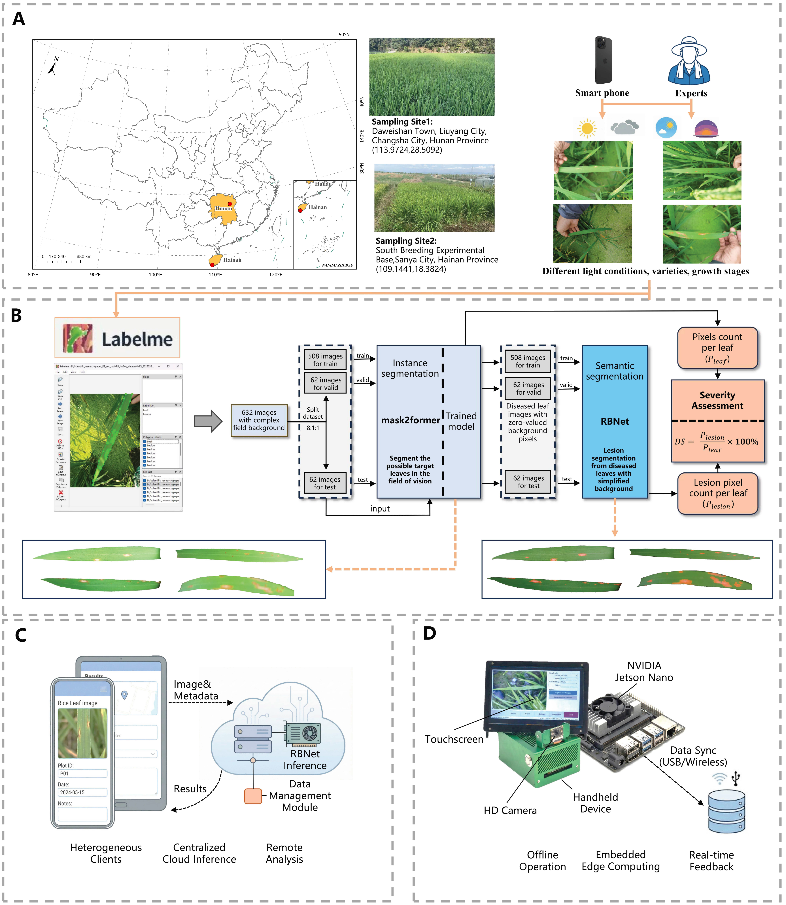

## AnInstance–Semantic Cascade Framework with RBNet for In-Situ Rice Blast Severity Quantification in Multi-Leaf Field Scenes

  <strong>Authors:</strong> 
  Xuzhe Yanga, Chuanjing Jina, Juntao Hua, Wanneng Yangd, 
  Congcong Sunc, Qin Gub, Bing Liua, Weixing Caoa, 
  Yan Zhua, Liujun Xiaoa,*

 

  a National Engineering and Technology Center for Information Agriculture, Engineering Research Center of Smart Agriculture, Ministry of Education, Key Laboratory for Crop System Analysis and Decision Making, Ministry of Agriculture and Rural Affairs, Jiangsu Key Laboratory for Information Agriculture, Jiangsu Collaborative Innovation Center for Modern Crop Production, Nanjing Agricultural University, Nanjing 210095, Jiangsu, China 
  b State Key Laboratory of Agricultural and Forestry Biosecurity, College of Plant Protection, Nanjing Agricultural University, Nanjing 211800, Jiangsu, China 
  c Agricultural Biosystems Engineering Group, Wageningen University, Wageningen 6700AA, The Netherlands 
  d National Key Laboratory of Crop Genetic Improvement, National Center of Plant Gene Research, Hubei Hongshan Laboratory, Huazhong Agricultural University, Wuhan 430070, Hubei, China

 

  * Corresponding author

<figure align="center">
  
  <figcaption>
    <strong>Figure 1.</strong> Schematic overview of the proposed technical workflow.
    (A) Sampling sites for dataset images.
    (B) RBNet cascade framework.
    (C) Web application architecture.
    (D) Handheld device architecture.
  </figcaption>
</figure>

The source code of **RBNet** is currently being organized and will be made publicly available upon completion.
